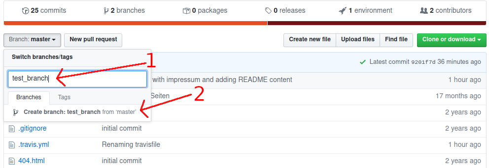
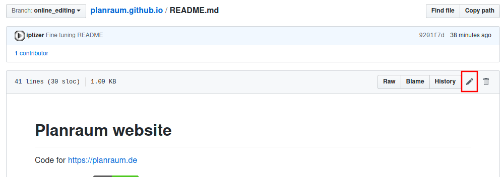
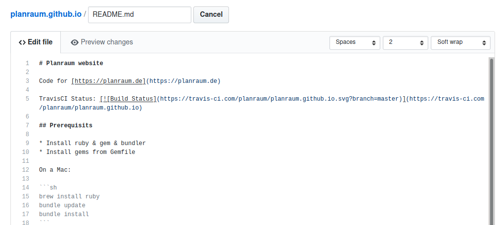
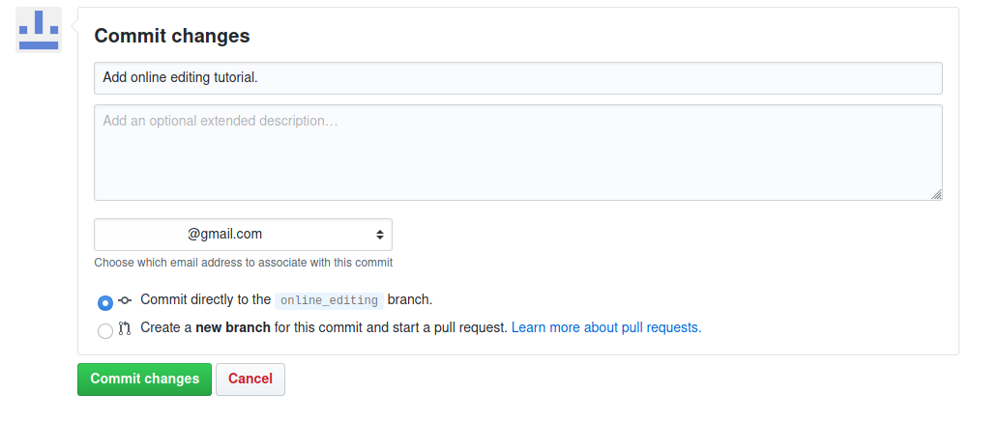
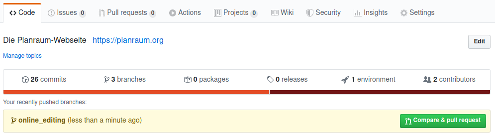
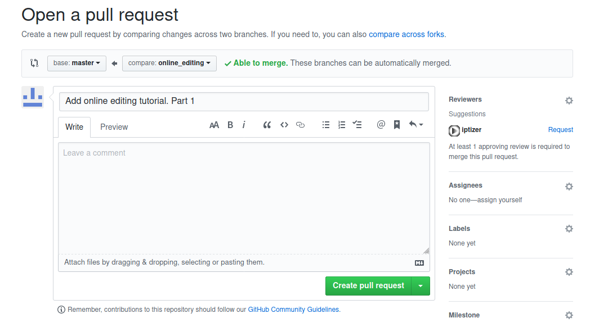

# Planraum website

Code for [https://planraum.de](https://planraum.de)

TravisCI Status: [](https://travis-ci.com/planraum/planraum.github.io)

## Prerequisits

* Install ruby & gem & bundler
* Install gems from Gemfile

On a Mac:

```sh
brew install ruby
bundle update
bundle install
```

## Adding new content

* Create a feature branch (master branch is protected)
* Make your changes
* push & create a pull request

### Online editing
All editing can be done online via the Github website.

1. Create a new branch

    Type your branch name into the field in the branch selector. 
    

2. Change a file

    Open the file and click the edit button.
    

3. Edit file

    Text is in markdown format. Most thing are pretty self-explanatory if you look at an existing file. A good reference is the [Markdown Cheatsheet](https://github.com/adam-p/markdown-here/wiki/Markdown-Cheatsheet)
    

4. Commit file

    At the bottom of the page there is the option to commit changes. Please add at least a short description of the changes.
    

5. Create pull request

    (Only do this when you are done editing.) Github shows a button to create a pull request when you have recent edits. Just click this button.
    
    
 6. Describe pull request.
 
     You can add an pull request summary, but most of the time the default summary from your commit message should be fine.
     So just click the big green button and you are done.
     
     
 7. Review
 
     Someone will review and merge your pull request. Your change will appear on the website once this is done.


### Command line

```sh
# Assuming you're in branch master
# Create a branch with a name that describes your changes
BRANCH_NAME="my_cool_new_content"
git checkout -b $BRANCH_NAME
# Make your changes. You can start a local dev server using bundle.
bundle exec jekyll serve
# Add your changes to the repository
git add .
git commit -m "Describe your change in the message"
git push --set-upstream origin $BRANCH_NAME
```

Open a pull request via [the GitHub compare function](https://github.com/planraum/planraum.github.io/compare). Select your branch on the right side. Verify your changes. And click on "Create Pull Request".
